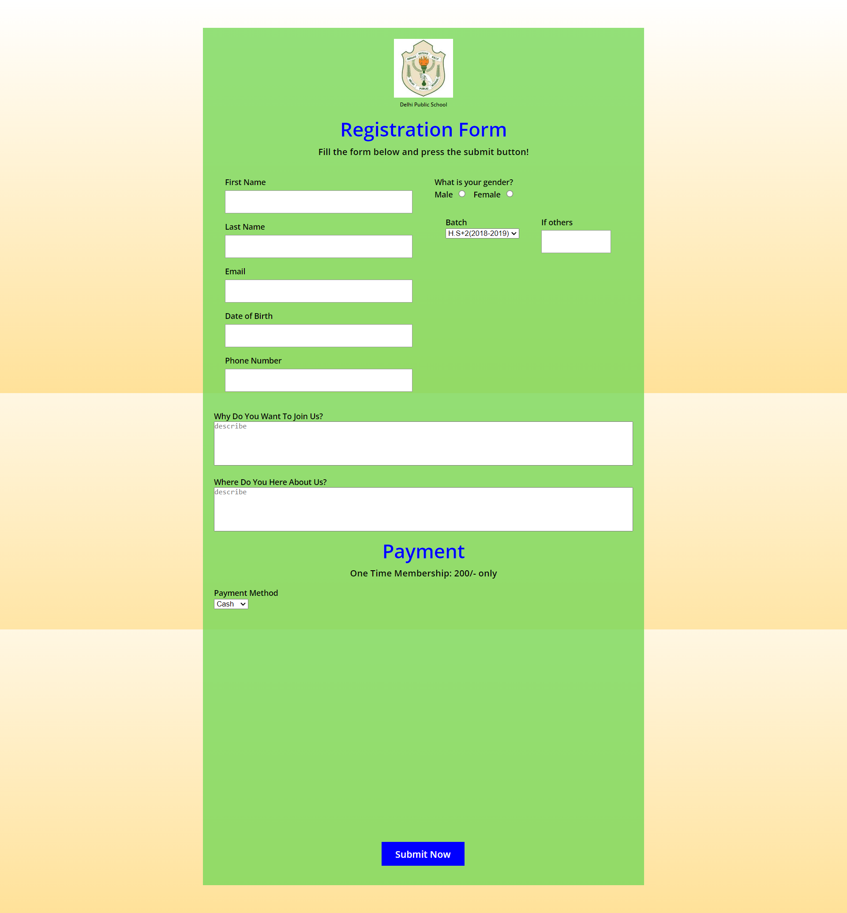

<!DOCTYPE html>
<html>
<head>
  <meta charset="UTF-8">
</head>
<body>
  <h1>Responsive_Form</h1>

  
Learn how to create a responsive registration form using HTML, CSS, and JavaScript. This form connects with Google Sheets to securely save user registration details. Enhance data management and storage by integrating the form with Google Sheets, making the registration process seamless and efficient.

  

  <h2>Features</h2>
  <ul>
    <li>Fully responsive design that adapts to different screen sizes</li>
    <li>Clean and modern user interface</li>
    <li>Valid HTML markup</li>
    <li>Easy to customize and integrate into your project</li>
  </ul>

  <h2>Usage</h2>
  <ol>
    <li>Clone the repository:</li>
    <pre><code>git clone https://github.com/Aarush1137/Responsive_Form.git</code></pre>
    <li>Navigate to the project directory:</li>
    <pre><code>cd Responsive_Form</code></pre>
    <li>Open <code>index.html</code> in your preferred web browser.</li>
    <li>Customize the form by modifying the HTML and CSS code according to your requirements.</li>
  </ol>

  <h2>Folder Structure</h2>
  <ul>
    <li><code>index.html</code>: The main HTML file containing the form markup.</li>
    <li><code>style.css</code>: The CSS file for styling the form.</li>
    <li><code>preview.png</code>: Preview image of the form.</li>
    <li><code>LICENSE</code>: The license file for the project.</li>
  </ul>

  <h2>Customization</h2>
  
You can customize the form by modifying the HTML and CSS code. The <code>index.html</code> file contains the form structure, and you can make changes to the form fields, labels, and styling in the <code>style.css</code> file.

  <h2>License</h2>
  
This project is licensed under the <a href="LICENSE">MIT License</a>.

  <h2>Contributing</h2>
  
Contributions are welcome! If you find any issues or have suggestions for improvement, please feel free to create an issue or submit a pull request.

  <h2>Support</h2>
  
If you have any questions or need assistance, please open an issue in the <a href="https://github.com/Aarush1137/Responsive_Form/issues">GitHub repository</a>.

  <h2>Disclaimer</h2>
  
This project is provided as-is with no warranty or guarantees. Use at your own risk.

</body>
</html>

